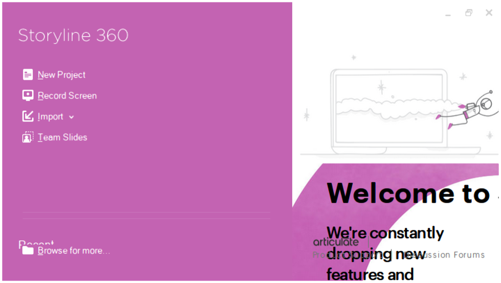
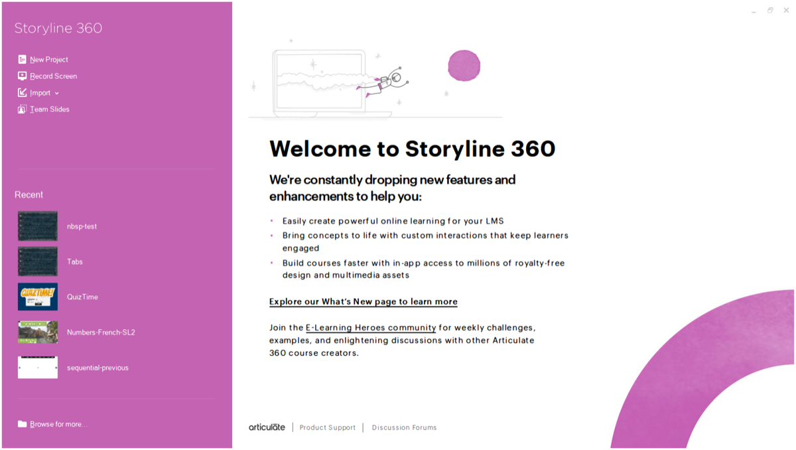

# Run 25 — Retina displays: keep Storyline's layout, double it with xBR

## Why
Slide text and the rest of Storyline's window looked soft on a Retina MacBook Pro (1440×900 points, 2880×1800 pixels). The prefix ran with `RetinaMode=n` at 96 DPI, so macOS doubled every pixel.

## What Storyline does
Storyline is DPI-unaware by design. `Program.cs` calls `Application.SetHighDpiMode(DpiUnaware)`, and its Metro theme uses fixed pixel sizes (11 px ribbon font, 90 px ribbon). Articulate's own guidance is 100% scaling (96 DPI) with a minimum of 1,280×800.

The slide canvas renders into a DIB section the size of its client area, so the slide is only ever drawn at the window's DPI. Nothing after that can add detail.

## What was tried
Each setup was launched on the same project and scored on the same slide sentence (share of in-between grey pixels in the text; lower is sharper).

| Setup | Layout | Score |
|---|---|---|
| RetinaMode off, 96 DPI (previous setup) | normal | 0.66 |
| RetinaMode on, 192 DPI, unaware, Wine's halftone doubling | normal | 0.87 |
| RetinaMode on, 192 DPI, unaware, pixel replication | normal | 0.66 |
| RetinaMode on, 192 DPI, unaware, xBR (this run) | normal | 0.73 |
| RetinaMode on, 192 DPI, forced DPI-aware (`dpiAwareness=1` IFEO value) | half-size UI | 0.40 |

- **Forced DPI-aware** is the only setup with truly sharp slide text, but the fixed-pixel UI is half size. Scaled stand-in fonts (Selawik at 1.25× and 1.5× via FontSubstitutes) made it readable but truncated ribbon tabs, the Player Properties dialog and trigger descriptions.
- **Upscaling filters** were compared offline first on Storyline's actual 1× slide buffer (recovered from the pixel-replication capture): nearest, bilinear, bicubic, Lanczos, spline, xBR, hqx, EPX, 2xSaI and sharpened variants. xBR kept curves smooth and edges crisp without the heavier strokes of sharpening. The score counts xBR's smoothed stair-steps as grey, so it scores slightly worse than pixel replication while looking cleaner.
- **Mixed DPI (only the slide canvas at 2×)** is not possible in Wine today: child windows never get their own surface (`dlls/win32u/window.c`, `if (is_child) needs_surface = FALSE`), and all of Storyline's windows share one generic WinForms class name, so the canvas can't be singled out at creation.

## Fix: patch 0020 and Retina mode
`tools/wine-patches/0020-win32u-xbr-filter-for-scaled-dpi-unaware-windows.patch` adds `WINE_SCALE_FILTER` to the scaled window surface in `dlls/win32u/dce.c`:
- `xbr`: when the scale is exactly 2× and both surfaces are plain 32-bit top-down DIBs, the dirty region is enlarged with xBR level 2 straight into the Retina surface. Anything else falls back to the existing `StretchBlt`.
- `nearest`: pixel replication (no halftone), kept for comparison.
- unset: unchanged halftone behaviour.

Both Dock launchers export `WINE_SCALE_FILTER=xbr`, and Storyline started from the Desktop App inherits it. `build-prefix-dotnet48.sh` now sets `RetinaMode=y` and `LogPixels=192` (both keys). `build-ntdll.sh` applies the patch with the other win32u patches.

Patching Wine rather than Storyline keeps to the rule of no patched Articulate binaries.

## Results
- The xBR code, compiled on its own and run on the 1× slide buffer, matches ffmpeg's `xbr=2` output at 69 dB PSNR (visually identical).
- A full 1440×815 frame takes under 100 ms (5 runs in 0.57 s including process start and file I/O); normal edits only redraw small regions.
- Storyline through the Dock launcher, with `WINE_SCALE_FILTER` not set in the calling shell: the slide text scores 0.73 with 913 ink pixels, the same as the offline xBR result, so the launcher's setting reaches Wine.
- Layout is identical to the previous setup: Player Properties shows "Starts collapsed" in full and five rows of player controls.
- The Articulate 360 Desktop App's main window draws correctly with `RetinaMode=y` (Run 04e had seen blank WPF dialogs before WPF software rendering was turned on).

## Start-up race: Storyline sometimes opened at 720×407 (patch 0029)
With Retina mode on, Storyline occasionally opened in a broken state: `slauto list` reported its window as 720×407 instead of 1440×814, and the start page's web content was drawn at double size.

**Cause.** winemac turns Retina mode on for a process only if the current display mode matches the "initial display mode" stored in the volatile key `HKLM\Software\Wine\Mac Driver\Initial Display Mode`. The first process after the wineserver starts creates that key, then writes each display's values in separate calls. A process that starts at the same moment finds the key already there, assumes it is complete, and reads it. If the values aren't written yet, the match fails and `retina_on` is false for that whole process; it is only re-checked on a display change. The Dock launcher starts the Desktop Service and Storyline together, so a cold start (right after `wineserver -k` or a reboot) can hit this.

**Reproduction.** A test program created the key empty right after `wineserver -k` and filled in the real values 3 s later; a probe process started 1.5 s in:

| | Normal cold start | Probe while the key is still being written (3 runs) |
|---|---|---|
| Stock winemac | 2880×1800 mode, `HORZRES` 5760 | 1440×900 mode, `HORZRES` 1440 (Retina off), 3 of 3 |
| Patch 0029 | 2880×1800 mode, `HORZRES` 5760 | 2880×1800 mode, `HORZRES` 5760, 3 of 3 |

Storyline launched through the Dock launcher while the key was held empty, on stock winemac, opened in exactly the broken state above (720×407 in `slauto list`). Five natural cold starts with the key not held all came up correctly, so the race is rare in normal use.

**Fix.** `tools/wine-patches/0029-winemac-wait-for-the-initial-display-mode-to-be-written.patch` (`dlls/winemac.drv/display.c`): the process that creates the key writes a `Complete` value after all displays, and a process that finds the key already there waits for `Complete`, polling every 20 ms for up to 2 s. `build-ntdll.sh` applies it with the other winemac patches.

Storyline launched with patch 0029 (the key held empty for 1 s at start-up) opened normally:

## Resize cost
Start page, 40 cycles of resizing the main window to 3/4 size and back with a full redraw, Storyline main-process CPU time, one run each:

| Filter | CPU during 40 cycles |
|---|---:|
| xBR (`WINE_SCALE_FILTER=xbr`) | 53.0 s |
| Wine's default halftone (variable unset) | 62.6 s |

xBR adds no measurable cost here; nearly all of it is the start page's web content laying out again after each resize.

## Desktop App
- The main window draws correctly with Retina mode on.
- Storyline opened with the Desktop App's Open button has `WINE_SCALE_FILTER=xbr` in its environment block (read from another process), and its window is DPI-unaware at 1440×817, scaled to 2880×1634.

## Not yet verified
- The Desktop App's secondary WPF dialogs (Run 04e's "Unable to Install" dialog was the one that went blank).
- Layered windows (`alpha_mask` set) still use `StretchBlt` without halftone, as before.
- A key left incomplete by a crashed writer makes each later process wait the full 2 s once, until the wineserver restarts.
