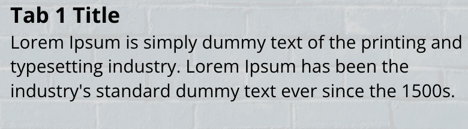
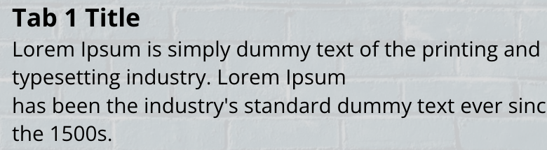
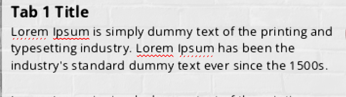
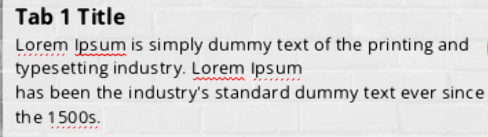

# Run 29 — No-break spaces don't keep words together

## Why
[Issue #20](https://github.com/elearningplugins/storyline-on-mac/issues/20) collects more than a decade of forum reports that a no-break space (U+00A0) in Storyline slide text still lets the line wrap there. On a Mac this matters more, because Option+Space types U+00A0.

## Reproduction
- `Tabs.story` (from Run 27) with Tab 1's first paragraph changed so that "has been the industry's" is joined by U+00A0, and Tab 2's the same way with U+202F (narrow no-break space). The characters were written into both the `<text>` and `<plain>` copies of the paragraph in the slide XML, and the file was repacked with each entry's original order and compression (repacking with `zip -r` makes Storyline report the file as corrupt).
- The project uses Modern Text (`renderingEngineType="DirectWrite"` in `story/story.xml`).
- Published to Web. Slide text is published as SVG, one element per line, in `html5/data/js/paths.js`, so the published line splits are Storyline's own layout.

Without the fix, Storyline keeps both characters (they reach `paths.js` unchanged) but breaks the line straight after "the", at a no-break space:

```
59.198  'typesetting industry. Lorem Ipsum has\xa0been\xa0the\xa0'
77.355  "industry's standard dummy text ever since the 1500s."
```

## Cause
- Storyline decides where a line may break itself, from DirectWrite's line breakpoints. It treats a position as a legal break if DirectWrite marks it as a soft break opportunity **or** as white space (`DWRITE_LINE_BREAKPOINT.isWhitespace`), plus a few characters of its own (tab, ellipsis, after a hyphen).
- Wine's `AnalyzeLineBreakpoints` correctly returns "may not break" around U+00A0 (UAX #14 class GL), but reports `isWhitespace` from `opentype_is_whitespace`, which follows the Unicode White_Space property and includes U+00A0, U+2007 and U+202F. Storyline's white-space rule then allows the break anyway.
- DirectWrite on Windows is expected to report the same `isWhitespace` values, which fits the forum reports coming from Windows users. This was not measured on Windows. It means the bug is Storyline's, not a Wine difference, so the fix is opt-in rather than a change to Wine's default behaviour.

## Fix: patch 0026
`tools/wine-patches/0026-dwrite-opt-in-no-break-spaces-are-not-white-space.patch` changes one line of `analyze_linebreaks` in `dlls/dwrite/analyzer.c`. With `WINE_DWRITE_NBSP_NOT_WHITESPACE=1`, U+00A0, U+2007 and U+202F get `isWhitespace = FALSE`. The break conditions are unchanged, and without the variable nothing changes. The variable is read once per process.

- `build-ntdll.sh` applies it after 0002 in the dwrite step.
- `tools/launcher/storyline-args.sh`, which both Dock launchers source, exports `WINE_DWRITE_NBSP_NOT_WHITESPACE=1`.

## Results
**Published output**, same project, cold launch each time, the patched `dwrite.dll` installed in both runs, only the variable changed:

| | Line at y = 59.198 | Line at y = 77.355 |
|---|---|---|
| Variable unset | `typesetting industry. Lorem Ipsum has␣been␣the␣` | `industry's standard dummy text ever since the 1500s.` |
| `WINE_DWRITE_NBSP_NOT_WHITESPACE=1` | `typesetting industry. Lorem Ipsum ` | `has␣been␣the␣industry's standard dummy text ever since ` |

(␣ is U+00A0.) With the variable set, the joined words move to the next line together, and the paragraph gains a line. Tab 2 (U+202F) splits the same way in both runs. Tabs 3 to 5, which have no no-break spaces, produce identical lines in both runs.

**Rendered** in headless Chromium from each published output, Tab 1 opened:

| Variable unset | `WINE_DWRITE_NBSP_NOT_WHITESPACE=1` |
|---|---|
|  |  |

**Authoring canvas**, Tab 1 layer open in slide view, Storyline relaunched with and without the variable:

| Variable unset | `WINE_DWRITE_NBSP_NOT_WHITESPACE=1` |
|---|---|
|  |  |

The canvas breaks the lines exactly as the published output does.

**Wine's dwrite `analyzer` tests** (built out of tree, loaded with the old DLL, the new DLL, and the new DLL with the variable set): output is identical in all three. Each has the same 2 failures, both caused by the out-of-tree build lacking the test font resource (`couldn't find resource` at `analyzer.c:542`, then `hr 0x80004005` at line 569). No existing test covers no-break spaces in line breakpoints.

## Not verified
- Preview.
- What Option+Space inserts into a Storyline text box under winemac (real macOS key events need Accessibility permission, which neither Cursor nor Terminal has in this lab).
- Classic Text (Uniscribe); this patch does not touch it.
- U+2011 (non-breaking hyphen), justified text, and the other examples listed in the issue.
- Windows.
