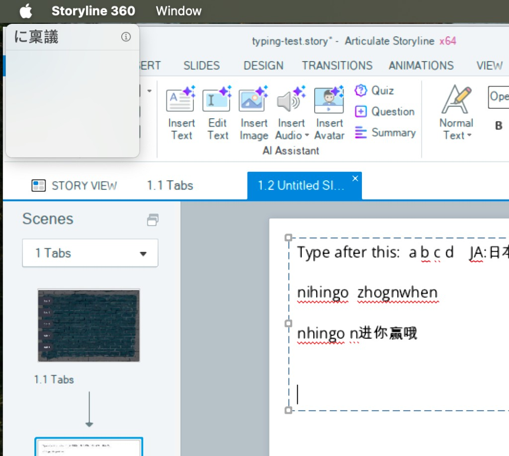
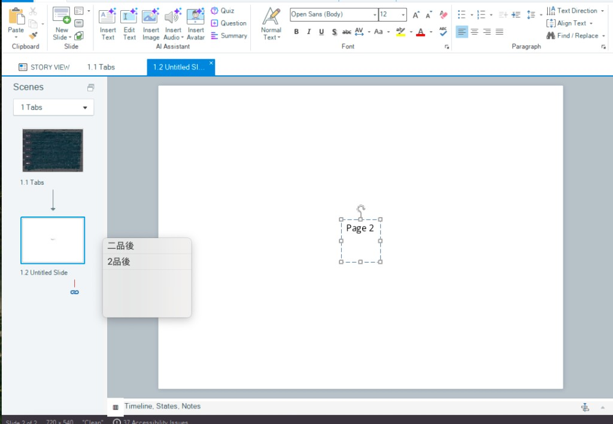

# Run 30 — Japanese and Chinese candidate list opens at the top left of the screen

## Why
While typing Japanese (Romaji) and Chinese (Pinyin) into a slide text box, the macOS candidate list opened in the top left corner of the screen, far from the text box.

## Cause
- On macOS, Wine's Mac driver answers the input method's `firstRectForCharacterRange` query with one stored rectangle, `ime_composition_rect`. Only two things set it: `ImmSetCompositionWindow` with a `CFS_POINT`, `CFS_RECT` or `CFS_FORCE_POSITION` form, and `SetCaretPos` when a visible Win32 caret moves.
- Storyline's slide text editor draws its own caret and has no Win32 caret (`GetGUIThreadInfo` reports no `hwndCaret` for the Storyline thread). An IMM trace showed only `ImmSetCompositionFontW`, with no `ImmSetCompositionWindow` or `ImmSetCandidateWindow` calls. So the rectangle stayed at 0,0.
- It sometimes looked right before because a WPF text field (the AI Assistant popup's) had a real caret, and its last position stayed in the rectangle.
- Windows places the default IME window at the bottom left of the target window when the app sets no composition form (`CFS_DEFAULT`); Wine's own composition window in `dlls/imm32/ime.c` already does the same.

## Fix: patch 0027
`tools/wine-patches/0027-imm32-default-IME-composition-rect-at-the-bottom-left-of-the-focus-window.patch` adds `ime_set_default_composition_rect` to `dlls/imm32/ime.c`. `ImeToAsciiEx` calls it for each real key, before the key reaches the macOS input method. When the context has no composition form other than `CFS_DEFAULT` and the thread has no caret, it passes the bottom left of the target window's client area to `SetIMECompositionRect`. Apps that set a composition form, or that have a caret, keep the existing behaviour.

The client rectangle is read in per-monitor DPI mode, because `set_ime_composition_rect` treats its input as per-monitor coordinates. The first attempt used the thread's own coordinates; in the Retina mode those are half size, and the list opened halfway down the canvas instead of at its bottom:

`build-ntdll.sh` builds `imm32.dll` (64- and 32-bit) with the patch, after the user32 step.

## Results
- Japanese Romaji, keyboard only (`nihongo`, Space), Storyline in the Retina mode, patched `imm32.dll` installed: the candidate list opens at the bottom left of the slide canvas. Checked by eye on the Mac; there is no screenshot of the final build because screen captures from the agent's session showed only the desktop at the time.
- The focus window is the whole slide canvas, not the text box, so the list is not next to the typed text. Storyline does not report its caret position through any Win32 API, so a closer position would have to be guessed (for example from the last click).

## Not fixed
- Clicking the candidate list, or anything that deactivates Storyline mid-composition, cancels the Wine-side composition while macOS keeps the marked text, so the choice is not inserted. Choosing with the arrow keys and Return works.
