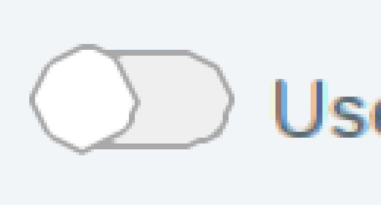
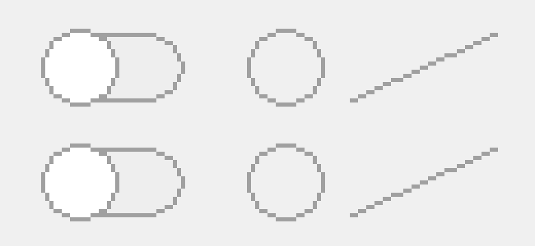
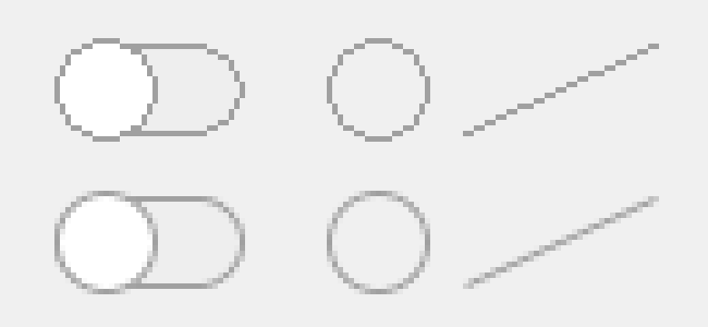
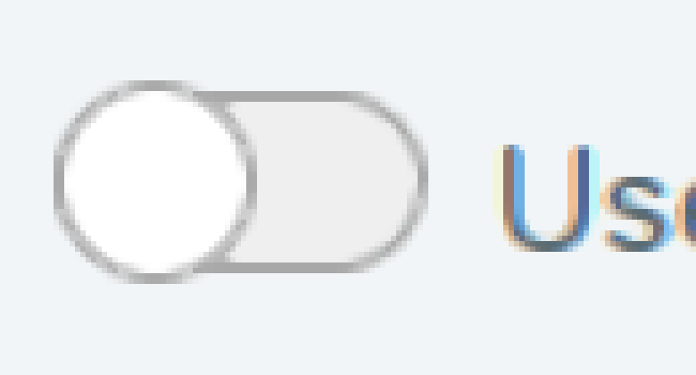

# Run 32 — Anti-aliased GDI+ fills and strokes

## Why
The "Use experimental features" toggle at the top of the AI Assistant panel looked jagged: the knob and the track's rounded ends were drawn as rough octagons.

## Cause
- `AiSidePanelHost.OnPaint` sets `Graphics.SmoothingMode` to `AntiAlias` and then paints the toggle with GDI+: `FillPath` and a 1 px `DrawPath` on a 34x16 rounded rectangle built from four 90° arcs, then `FillEllipse` and `DrawEllipse` on an 18x18 knob.
- Wine's gdiplus stores the smoothing mode (`GdipSetSmoothingMode`) but no drawing code reads it. On a window's HDC, fills go to GDI's `FillPath` and strokes to GDI's path drawing, both aliased. The README listed this as "Antialiasing | MISSING".
- Every other GDI+ shape call (ellipses, pies, polygons, rectangles, lines, arcs, curves) goes through `GdipFillPath` or `GdipDrawPath`, so the same gap affects all anti-aliased UI.

## Fix: patch 0030
`tools/wine-patches/0030-gdiplus-anti-alias-path-fills-and-strokes.patch` changes `dlls/gdiplus/graphics.c`:
- `GdipFillPath` calls a new `AA_GdipFillPath` when the smoothing mode is `AntiAlias` or `HighQuality` (and the compositing mode is not `SourceCopy`). It transforms the path to device space, scales it by 4 and rasterizes it with gdiplus's own region scanner, which samples at integer points. The offset puts each pixel's 16 samples at ±0.125 and ±0.375 around its centre, matching Wine's existing aliased sampling. It then counts covered samples per pixel, fills the pixels with `brush_fill_pixels`, scales alpha by coverage and blends with `alpha_blend_pixels`, which applies the graphics clip. So it works for any brush the software path supports, on both HDC and bitmap targets.
- `GdipDrawPath` uses the software path when anti-aliasing, and `SOFTWARE_GdipDrawPath` widens strokes of any positive width (instead of drawing pens under ~1.4 px as aliased thin lines), so the widened outline gets the same coverage treatment. Anti-aliased strokes are widened at GDI+'s default flatness (0.25 px) instead of 1 px. With 1 px, each quarter arc of the 16 px track became two straight segments, which show as corners once the edges are smooth.
- Drawing with anti-aliasing off does not change. Metafile recording, `SourceCopy` compositing and brushes the software path cannot fill keep their old paths, as do areas over 4096x4096 px.

`build-ntdll.sh` applies it after 0024 in the gdiplus step.

## Results
Test program: Storyline's disabled toggle geometry, a circle outline and a diagonal line, drawn with GDI+ into a 32-bit DIB through `GdipCreateFromHDC`. The top row uses `SmoothingModeNone`, the bottom row `SmoothingModeAntiAlias`, shown at 6x. Before:

After:

The top (`SmoothingModeNone`) half is byte-identical before and after, both on an HDC and on a GDI+ bitmap.

Wine's gdiplus conformance tests (all 12 files, built against the same source) have identical test counts, todos and failing assertions with and without the patch: font 14 failures, graphics 2, image 4, metafile 6, the rest 0.

Storyline, AI Assistant panel, only `gdiplus.dll` swapped (these screenshots also have patch 0020's xBR Retina scaling, from [#18](https://github.com/elearningplugins/storyline-on-mac/pull/18), installed):

Cost, per `FillPath` + 1 px `DrawPath` of a rounded rectangle on a 1024x768 memory DC, microseconds:

| Shape | AntiAlias before (drawn aliased) | AntiAlias after | None before | None after |
|---|---:|---:|---:|---:|
| Toggle 34x16 | 372 | 731–785 | 380 | 322–389 |
| Button 200x40 | 748 | 1613–1873 | 767 | 654–760 |
| Panel 800x600 | 25960 | 39533–45072 | 26538 | 25829–27220 |

Anti-aliased drawing costs about twice as much as the aliased drawing it replaces.

## Not yet verified
- The toggle's "on" state (blue track, blue knob outline) was not clicked, because it changes a Storyline preference; it uses the same `FillPath`/`DrawEllipse` calls.
- Other anti-aliased Storyline UI was not checked one by one.
- Anti-aliased text rendering (`TextRenderingHint`) is separate and not part of this change.
