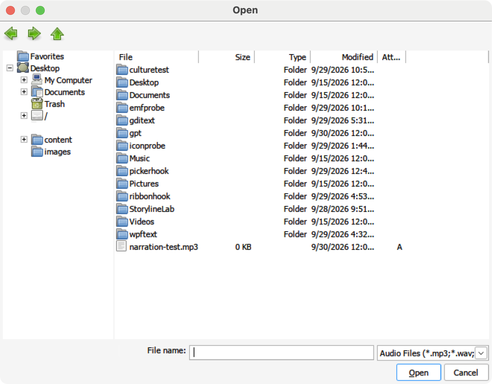
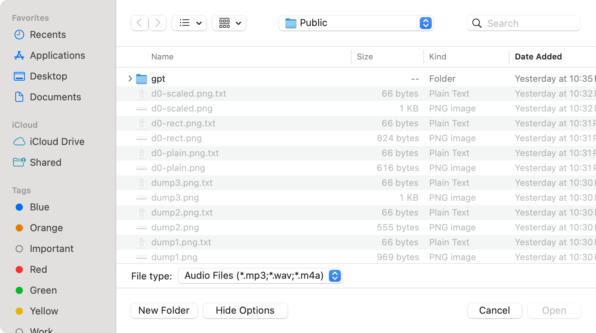
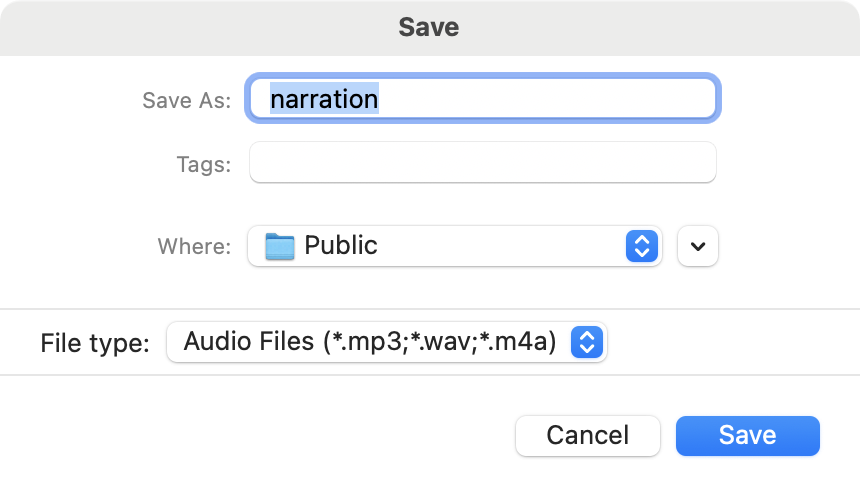
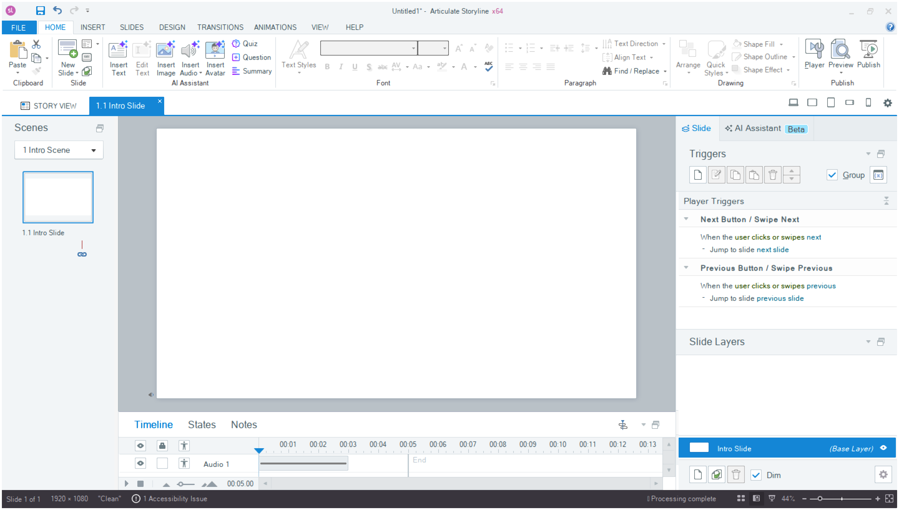

# Run 33 — Native macOS open and save panels

## Why
Insert > Audio, Save As and every other file dialog in Storyline opened Wine's own file browser: a Windows XP-style window with green arrows, a folder tree of Wine drive names and a file list that doesn't match the Mac's.

## Cause
- Storyline's open and save dialogs are WinForms `OpenFileDialog` and `SaveFileDialog`, which use the Vista common item dialog (`IFileOpenDialog`/`IFileSaveDialog`). Its folder picker (e.g. Publish > Folder "…") uses the Windows API Code Pack `CommonOpenFileDialog` with `FOS_PICKFOLDERS`, which is the same interface.
- In Wine all of these end up in `dlls/comdlg32/itemdlg.c`, which draws the dialog from a Win32 dialog template. Nothing in Wine hands the dialog to macOS.

## Fix: patch 0031
`tools/wine-patches/0031-winemac-comdlg32-show-the-native-macOS-open-and-save-panels.patch`:
- **winemac.drv:** a new `cocoa_filedialog.m` runs an `NSOpenPanel` or `NSSavePanel` on the main thread with `beginWithCompletionHandler`, so the Cocoa event loop keeps running. Filters appear in a "File type:" pop-up menu. A panel delegate greys out files that don't match the selected filter's patterns (`fnmatch`, case-insensitive; `*` and `*.*` match everything). On save panels, plain `*.ext` patterns become `allowedFileTypes`, so macOS adds the extension. Three unix calls (start, result, close) reach it. The PE side exports `wine_file_dialog_show`, `wine_file_dialog_result` and `wine_file_dialog_close` through a new `winemac.drv.spec`.
- **comdlg32:** `IFileDialog::Show` first tries `show_mac_dialog`. It passes the title, OK button text, start folder (converted to a unix path), file name, filters, filter index and the multi-select, pick-folders and show-hidden options. Then it waits for the panel while pumping messages, with the owner window disabled. The UTF-8 paths that come back are converted to DOS paths (`C:\` inside the prefix, `Z:\` elsewhere) and turned into results the way Wine's own dialog does (`on_default_action`): it adds the filter's or default extension on save and sets the folder and file name. Then it calls `OnOverwrite` and `OnFileOk`. If `OnFileOk` refuses, the panel opens again. Cancel returns `HRESULT_FROM_WIN32(ERROR_CANCELLED)`.
- Wine's dialog is still used for dialogs with custom controls (`IFileDialogCustomize`) or an Open drop-down, when winemac isn't the driver, and when `WINE_MAC_FILE_DIALOGS=0` is set.
- The Mac save panel asks before replacing a file, so Wine's own "File already exists" box is skipped for the name the panel returned. It still appears when comdlg32 added the extension after the panel closed, because macOS never saw that name. Without this change the user was asked twice.

`build-ntdll.sh` applies it in the winemac step after 0016, refreshes the generated Makefile (0031 adds files to `winemac.drv/Makefile.in`) and builds `winemac.so` plus the 64- and 32-bit `winemac.drv` and `comdlg32.dll`. The patch applies to pristine wine-11.16 after 0005, 0010 and 0016, with or without 0029 from [#18](https://github.com/elearningplugins/storyline-on-mac/pull/18).

## Results
Test program (`IFileOpenDialog`/`IFileSaveDialog` with "Audio Files (\*.mp3;\*.wav;\*.m4a)" and "All Files", an `IFileDialogEvents` sink and an owner window):

| Case | Result |
|---|---|
| Open, pick `narration-test.mp3` | `C:\users\Public\narration-test.mp3`, `OnFileOk` called once, file type index 1 |
| Save, rename to `renamed-test` | `renamed-test.mp3` (macOS added the extension) |
| Save over an existing `narration.mp3` | The Mac "Replace?" prompt only; `Show` returned `S_OK`, `OnFileOk` called once |
| Cancel | `Show` returned `0x800704C7` (`ERROR_CANCELLED`), `OnFileOk` not called |
| `WINE_MAC_FILE_DIALOGS=0` | Wine's dialog, as before |

In Storyline 360 (64-bit):
- Insert > Audio showed the Mac open panel, and the chosen `tone-test.mp3` was inserted as an Audio 1 track on the timeline.
- Save As showed the Mac save panel and saved `Untitled1.story` in the chosen folder.
- Publish > Folder "…" showed the Mac folder chooser, and the Folder field updated to the chosen folder.

Wine's `itemdlg` conformance test, built standalone from the same source (the tests close Wine's dialog through its window, so they run with `WINE_MAC_FILE_DIALOGS=0`), gives the same result with the stock and patched `comdlg32.dll`: 1315 tests, 27 todo, 0 failures, identical todo lines.

## Limits
- While a Mac panel is open, the app gets no `OnFolderChange`, `OnSelectionChange` or `OnTypeChange` events, and `IFileDialog::Close` and `IOleWindow::GetWindow` have no dialog window to act on. WinForms, and so Storyline, uses none of these.
- Older `GetOpenFileName`/`GetSaveFileName` dialogs (`filedlg.c`) are unchanged and still show Wine's dialog. Storyline's dialogs don't use them.

## Not yet verified
- Multi-select open (`FOS_ALLOWMULTISELECT`) was not tried; the code returns every selected path.
- The 32-bit Articulate 360 Desktop App was not checked; its `winemac.drv` and `comdlg32.dll` are built and installed, and the unix calls use the same functions for wow64.
