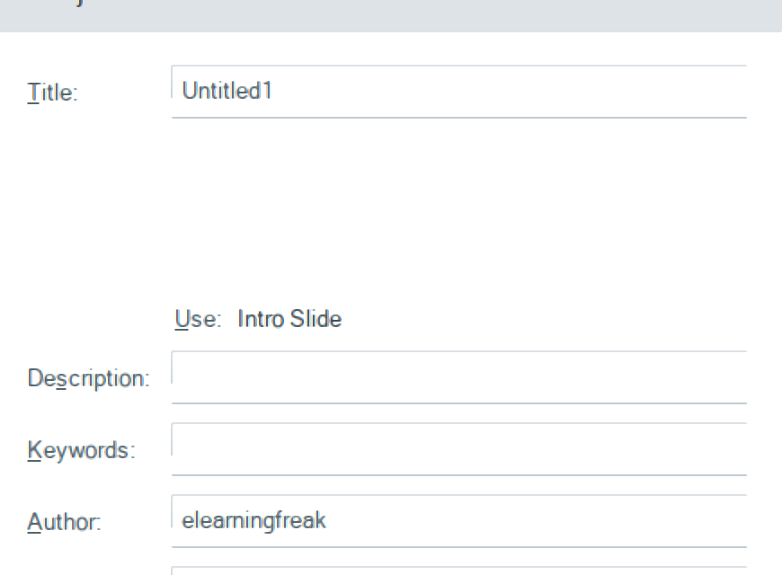
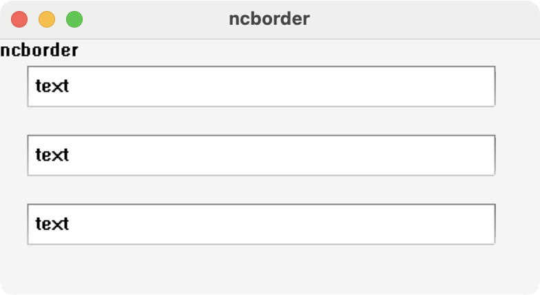
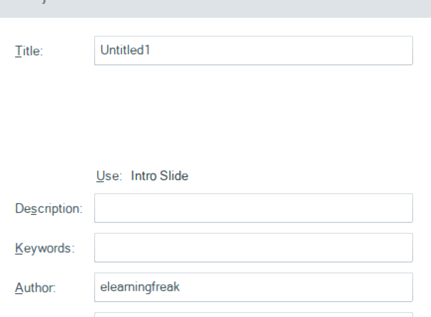

# Run 34 — Text box borders cut off on the right

## Why
In Publish > Project Info (and other dialogs using Storyline's Metro text boxes), each text box had its top and bottom lines but no right edge, and its left edge stopped partway down.

## Cause
- `MetroTextBox` is a WinForms `TextBox` with no border. It reserves 6 px of padding on every side in `WM_NCCALCSIZE` and paints that padding itself in `WM_NCPAINT`. It gets a window DC with `GetDCEx(DCX_WINDOW | ...)` and wraps it in `Graphics.FromHdc`. Then `MetroRenderer.DrawControlBorder` draws solid top and bottom lines and draws the side lines with a pen whose brush is a vertical `LinearGradientBrush`.
- Wine's `GdipCreateFromHDC` stores `WindowFromDC(hdc)`, and `get_graphics_device_bounds` then uses `GetClientRect` of that window as the device bounds. For a window DC, that's wrong: the DC starts at the window's corner and covers the whole window. For a 340x30 text box the client area is 328x18.
- Solid 1 px lines go through GDI and are not clipped to those bounds. A gradient pen goes through `SOFTWARE_GdipDrawThinPath`, which clips its output area to the device bounds. The left line (x = 0) was cut off after row 18, and the right line (x = 339) fell outside and was skipped. A `+gdiplus` trace shows the left line's output area as `(0, 0, 1, 19)`, and no area at all for the right line.
- Not the cause: the `GetDCEx` clip region (a plain `GetWindowDC` gives the same result), the interior fill drawn afterwards, and anti-aliasing (off here).

## Fix: patch 0032
`tools/wine-patches/0032-gdiplus-use-the-whole-window-as-device-bounds-for-window-DCs.patch` changes `get_graphics_device_bounds` in `dlls/gdiplus/graphics.c` (+9 lines). The graphics may have been created from an HDC whose origin (`GetDCOrgEx`) is the window's top-left corner rather than its client origin. That is a window DC, so the bounds become the whole window rectangle. Client DCs, `GdipCreateFromHWND` and windows with no non-client area keep the client rectangle.

`build-ntdll.sh` applies it after the other gdiplus patches. It applies with or without 0030 from [#28](https://github.com/elearningplugins/storyline-on-mac/pull/28).

## Results
Test program: an EDIT control subclassed like `MetroTextBox` (6 px non-client padding, the same `GetDCEx` flags and the same four GDI+ lines with a gradient side pen), in three copies. Before:

After:

With a solid side pen instead of the gradient, the lines were complete before the patch too, which isolated the software drawing path.

Storyline, Publish > Project Info, after:

Wine's gdiplus conformance tests (all 12 files, built standalone from the same source) have identical test counts, todos and failure lines with the previous `gdiplus.dll` and with 0032: font 14 failures, graphics 2, image 4, metafile 6, the rest 0, all present before.

## Not a bug: the small audio icon
The speaker next to the slide after Insert > Audio is `SoundLayer.OnPaintShape` drawing the stock speaker image into the sound shape's 30x29 slide-unit box, inset by 2. It scales with the slide zoom like any other shape: about 11 px at the 44% zoom in the report, about 26 px at 100%. Windows draws it the same way.
