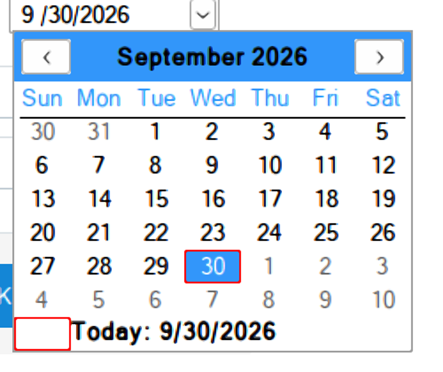
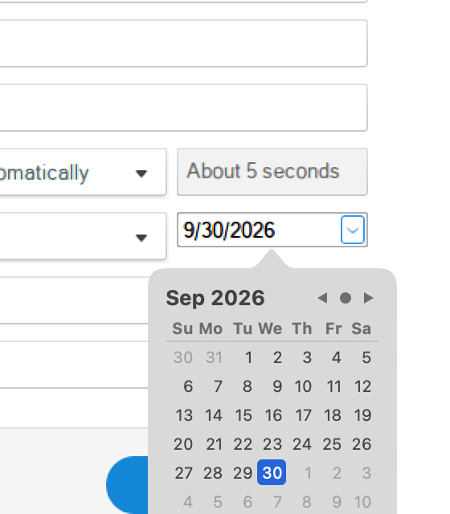

# Run 35 — Native macOS calendar for date pickers

## Why
In Publish > Project Info, setting Date to "Custom" and clicking the drop-down opened Wine's month calendar: a Windows-style grid with a blue title bar and a "Today:" footer. The field itself showed "9 /30/2026", with a gap after the one-digit month.

## Cause
- The field is a WinForms `DateTimePicker` (Format = Short; Storyline only sets and reads `Value`). It is the stock Win32 date and time picker from comctl32, and its drop-down is comctl32's month calendar. In Wine both live in `dlls/comctl32/datetime.c` and `monthcal.c`, drawn with GDI. Nothing hands them to macOS.
- `DATETIME_GetFieldWidth` gave every numeric field the width of "22", including one-digit fields such as the month in `M/d/yyyy`. A "9" in a two-digit-wide slot leaves the gap.

## Fix: patch 0033
`tools/wine-patches/0033-winemac-comctl32-show-the-native-macOS-calendar-for-date-pickers.patch` (+463/−2 Wine lines):
- **winemac.drv:** a new `cocoa_datepicker.m` shows a graphical `NSDatePicker` (year, month and day) in a transient `NSPopover` anchored below the control. It honours the control's minimum and maximum dates. Clicking a day of the shown month picks it and closes the popover. The month arrows only change the month, so the popover stays open. Return picks the highlighted day; Escape or a click elsewhere cancels. Three unix calls (start, result, close) reach it, and the PE side exports `wine_date_picker_show`, `wine_date_picker_result` and `wine_date_picker_close`. The unix side reads the control's rectangle at raw DPI, so the popover lands in the right place for apps that aren't DPI-aware.
- **comctl32:** the drop-down button first tries the Mac popover. The control sends `DTN_DROPDOWN`, reads the calendar's range, opens the popover and polls it from a 50 ms timer, so the app's message loop is never nested. A picked day replaces the year, month and day, keeps the time, recomputes the weekday, and sends `DTN_DATETIMECHANGE` and then `DTN_CLOSEUP`, as a click in Wine's calendar does. Clicking the drop-down button again closes the popover, and the click that dismissed it doesn't reopen it.
- Wine's calendar is still used when winemac isn't the driver, for calendars with multi-select, week numbers or day states, and when `WINE_MAC_DATE_PICKER=0` is set.
- One-digit fields are now measured from their text, so the date reads "9/30/2026".

`build-ntdll.sh` applies it right after 0031 and also builds and installs the 64- and 32-bit `comctl32.dll` and `comctl32_v6.dll`. Until now the lab mirror linked both to `/opt/local`. The patch extends 0031's unix-call table, headers and `.spec`, so it needs 0031 first.

## Results
Test program: a `DateTimePicker` (`DTS_SHORTDATEFORMAT`, comctl32 v6 manifest) set to 9/9/2026 13:45, logging its notifications.

| Case | Result |
|---|---|
| Click the drop-down | Mac calendar popover below the field, on September 2026 with the 9th selected |
| Click the month arrows | The month changes and the popover stays open |
| Click the 10th | `DTN_DATETIMECHANGE 2026-09-10 13:45`, weekday 4 (Thursday), then `DTN_CLOSEUP`; the field shows 9/10/2026 |
| Escape, click elsewhere, click the drop-down again | `DTN_CLOSEUP` only, the date unchanged, and the popover didn't reopen |
| 32-bit build of the same program | The popover opens and closes the same way |
| `WINE_MAC_DATE_PICKER=0` | Wine's month calendar, as before |

In Storyline 360 (64-bit), Publish > Project Info > Date "Custom": the drop-down opens the Mac calendar, picking a day updates the date, and clicking the drop-down again closes it.

Wine's `datetime` and `monthcal` conformance tests, built standalone from the same source and run against the patched DLLs: datetime 959 tests (8 todo), monthcal 2045 tests (19 todo, 2 skipped), 0 failures. They don't open the drop-down.

## Limits
- The popover replaces the month calendar window only visually. An app that customises the calendar through `DTM_GETMONTHCAL`, `DTM_SETMCCOLOR` or `DTM_SETMCFONT`, or that listens for the calendar's own `MCN_SELCHANGE`, gets none of that while the popover is up. Storyline does none of these.
- Month and weekday names in the popover follow the Mac's language and region settings, not the Windows locale in the prefix, and the popover always uses the Gregorian calendar.
- `DTM_GETIDEALSIZE` for formats with one-digit fields now depends on the current date, because the width comes from the text.
